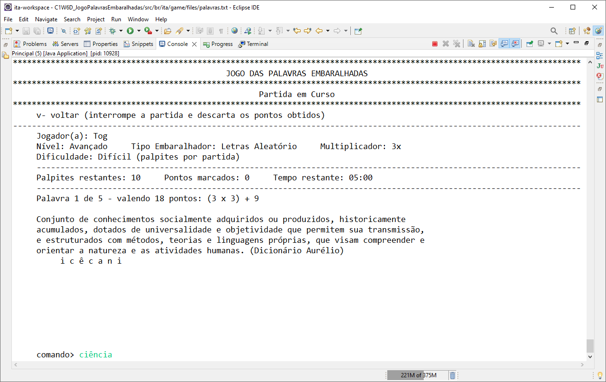

## Jogo das Palavras Embaralhadas

## Resumo
O Jogo das Palavras Embaralhadas é um projeto de **criação original** desenvolvido como trabalho final de conclusão do curso **Orientação a Objetos com Java**. O jogo apresenta uma lista de palavras embaralhadas para que o(a) Jogador(a) possa adivinhá-las mediante palpites.

A aplicação permite o cadastro de vários jogadores, que podem competir entre si, em um estimulante sistema de **ranking**.

O jogo roda na **console**, possui **três embaralhadores** e **três dinâmicas** de partida.

O Jogo das Palavras Embaralhadas é uma joia da engenharia de software que contempla **Modelagem CRC**, **Tell Don't Ask**, **Law of Demeter**, **Herança**, **Polimorfismo** e o padrão de projetos **Factory Pattern**.  

Para maiores informações, visite a página oficial do projeto:  
<https://togtec.dev.br/projetos/jogo-das-palavras-embaralhadas/resumo.php>

## Tecnologias
  * Java SE (11)
  * JUnit (5)
  
## IDE  
  * Eclipse

## Captura de tela

## Funcionalidades
1. Usuário cadastra um Jogador no sistema (define nome e apelido)
2. Usuário seleciona o Jogador cadastrado
3. Jogador seleciona o **Nível de Experiência** do Jogador
    - **Iniciante**: Apenas as sílabas são embaralhadas
    - **Intermediário**: As letras são embaralhadas de forma padronizada
    - **Avançado**: As letras são embaralhadas de forma aleatória
4. Jogador seleciona o **Grau de Dificuldade** da Partida
    - **Fácil**: Jogador não possui limite de palpites
    - **Normal**: Jogador possui 3 palpites por palavra
    - **Difícil**: Jogador possui 10 palpites por partida
5. Jogador disputa a partida
6. Jogador acessa o Relatório de Progresso (contém a pontuação final da partida)
7. Jogador acessa o Ranking (para ver sua posição em relação aos demais concorrentes)

## Executando o código localmente
Executar o Jogo das Palavras Embaralhadas em sua máquina é muito fácil. Certifique-se de ter o Eclipse instalado e siga as instruções abaixo. 

1. Baixe o projeto.
2. Importe-o no Eclipse.
3. Localize a classe **Principal** no pacote **br.ita.game**
4. Execute-a como **Java Aplication**
5. Configure a console do Eclipse — ver como na seção **Configurações** do **Vídeo de Divulgação do Projeto**:
<https://www.youtube.com/watch?v=n1a76wFeRuo>
 
