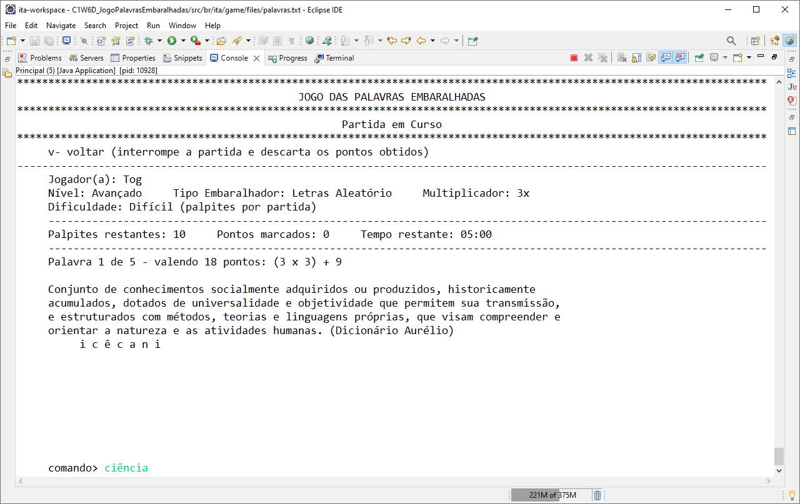

# Jogo das Palavras Embaralhadas   Scrambled Words Game 

## Escolha seu Idioma   Choose Your Language 

- [Português (Brasil)](#versão-em-português)
- [English (United States)](#english-version)

 

##  Versão em Português

### Jogo das Palavras Embaralhadas - Resumo
O **Jogo das Palavras Embaralhadas** é um projeto de **criação original** desenvolvido como trabalho final de conclusão do curso **Orientação a Objetos com Java**. O jogo apresenta uma lista de palavras embaralhadas para que o(a) Jogador(a) possa adivinhá-las mediante palpites.

A aplicação permite o cadastro de vários jogadores, que podem competir entre si, em um estimulante sistema de **ranking**.

O jogo roda na **console**, possui **três embaralhadores** e **três dinâmicas** de partida.

O Jogo das Palavras Embaralhadas é uma joia da engenharia de software que contempla **Modelagem CRC**, **Tell Don't Ask**, **Law of Demeter**, **Herança**, **Polimorfismo** e o padrão de projetos **Factory Pattern**.  

Para maiores informações, visite a página oficial do projeto:  
<https://togtec.com.br/projetos/jogo-das-palavras-embaralhadas/resumo.php>

### Tecnologias
  * Java SE (11)
  * JUnit (5)
  
### IDE  
  * Eclipse

### Captura de tela

Ver galeria completa de imagens em:  
<https://togtec.com.br/projetos/jogo-das-palavras-embaralhadas/imagens.php>

### Funcionalidades
1. Usuário cadastra um Jogador no sistema (define nome e apelido)
2. Usuário seleciona o Jogador cadastrado
3. Jogador seleciona o **Nível de Experiência** do Jogador
    - **Iniciante**: Apenas as sílabas são embaralhadas
    - **Intermediário**: As letras são embaralhadas de forma padronizada
    - **Avançado**: As letras são embaralhadas de forma aleatória
4. Jogador seleciona o **Grau de Dificuldade** da Partida
    - **Fácil**: Jogador não possui limite de palpites
    - **Normal**: Jogador possui 3 palpites por palavra
    - **Difícil**: Jogador possui 10 palpites por partida
5. Jogador disputa a partida
6. Jogador acessa o Relatório de Progresso (contém a pontuação final da partida)
7. Jogador acessa o Ranking (para ver sua posição em relação aos demais concorrentes)

### Executando o código localmente
Executar o Jogo das Palavras Embaralhadas em sua máquina é muito fácil. Certifique-se de ter o Eclipse instalado e siga as instruções abaixo. 

1. Baixe o projeto.
2. Importe-o no Eclipse.
3. Localize a classe **Principal** no pacote **br.ita.game**
4. Execute-a como **Java Aplication**
5. Configure a console do Eclipse — ver como na seção **Configurações** do **Vídeo de Divulgação do Projeto**:
<https://togtec.com.br/projetos/jogo-das-palavras-embaralhadas/videos.php>

 

##  English Version

### Scrambled Words Game - Overview
The **Scrambled Words Game** is an original project developed as a final assignment for the **Object-Oriented Programming with Java** course. The game presents a list of scrambled words for players to guess by making word guesses.

The application allows multiple players to register, who can compete against each other in a stimulating **ranking** system.

The game runs on the **console**, featuring **three scramblers** and **three different game modes**.

The Scrambled Words Game is a gem of software engineering, incorporating **CRC Modeling**, **Tell Don't Ask**, **Law of Demeter**, **Inheritance**, **Polymorphism**, and the **Factory Design Pattern**.  

For more information, visit the official project page:  
<https://en.togtec.com.br/projects/scrambled-words-game/summary.php>

### Technologies
  * Java SE (11)
  * JUnit (5)

### IDE  
  * Eclipse

### Screenshot

See the full image gallery at:  
<https://en.togtec.com.br/projects/scrambled-words-game/images.php>

### Features
1. User registers a player in the system (defines name and nickname)
2. User selects the registered player
3. Player selects their **Experience Level**:
    - **Beginner**: Only the syllables are scrambled
    - **Intermediate**: Letters are scrambled in a standard way
    - **Advanced**: Letters are scrambled randomly
4. Player selects the **Match Difficulty Grade**:
    - **Easy**: Player has unlimited guesses
    - **Normal**: Player has 3 guesses per word
    - **Hard**: Player has 10 guesses per match
5. Player plays the match
6. Player accesses the Progress Report (shows the final score)
7. Player checks the Ranking (to see their position relative to other players)

### Running the code locally
Running the Scrambled Words Game on your machine is easy. Make sure you have Eclipse installed and follow the steps below.

1. Download the project.
2. Import it into Eclipse.
3. Locate the **Principal** class in the **br.ita.game** package.
4. Run it as a **Java Application**.
5. Configure the Eclipse console — see how in the **Settings** section of the **Project Demo Video**:
<https://en.togtec.com.br/projects/scrambled-words-game/videos.php>
 
